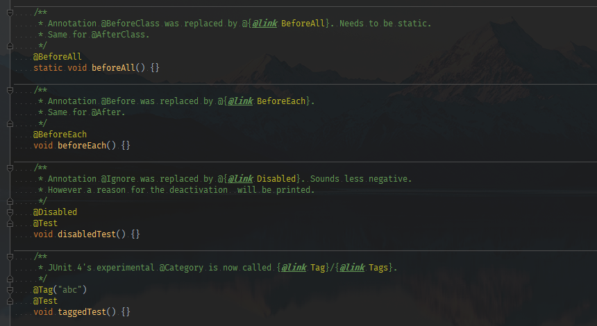
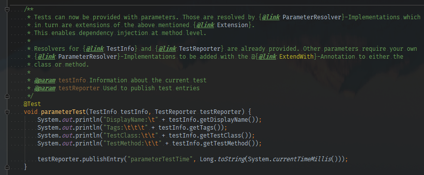
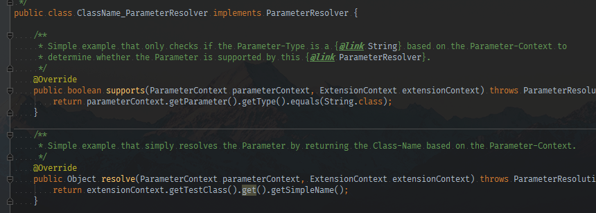
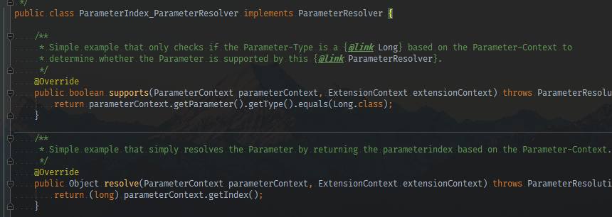

JUnit 5 Quickstart Guide and Samples
====================================

Table of contents
-----------------

- [Introduction] (#introduction)
    - [Intentions] (#intentions)
    - [Set-Up] (#set-up)
- [General changes] (#general-changes-code)
- [New features: Basics] (#new-features-basics-code)
    - [General] (#general)
    - [Assertions and Lambda-Support] (#assertions-and-lambda-support)
    - [Parameter Resolver] (#parameter-resolver)
- [New features: Advanced] (#new-features-advanced)
    - [Test-Factories] (#test-factories)
    - [Test-Extensions] (#test-extensions)
    - [Test-Parameters] (#test-parameters)
- [Advanced Test-Samples] (#advanced-test-samples-code)
- [Closing words] (#closing-words)


Introduction
------------

### Intentions
TODO

For source code see my GitHub-Repository:  
[**dmitrij-drandarov/JUnit-5-QuickStart-Guide-and-Samples**
](https://github.com/dmitrij-drandarov/JUnit-5-QuickStart-Guide-and-Samples)

### Set-Up
For an IDE I recommend *IntelliJ IDEA 2016.2(+)* right now since it brings native support for JUnit 5.  
As for dependencies:

*Maven*
```xml
  <dependency>
        <groupId>org.junit.jupiter</groupId>
        <artifactId>junit-jupiter-api</artifactId>
        <version>5.0.0-M2</version>
        <scope>compile</scope>
  </dependency>
```
```xml
  <dependency>
        <groupId>org.junit.platform</groupId>
        <artifactId>junit-platform-runner</artifactId>
        <version>1.0.0-M2</version>
        <scope>compile</scope>
  </dependency>
```
```xml
  <dependency>
        <groupId>org.junit.jupiter</groupId>
        <artifactId>junit-jupiter-engine</artifactId>
        <version>5.0.0-M2</version>
        <scope>runtime</scope>
  </dependency>
```

*Gradle*
```gradle
  testCompile group: 'org.junit.jupiter', name: 'junit-jupiter-api', version: '5.0.0-M2'
```
```gradle
  testCompile group: 'org.junit.platform', name: 'junit-platform-runner', version: '1.0.0-M2'
```
```gradle
  testRuntime group: 'org.junit.jupiter', name: 'junit-jupiter-engine', version: '5.0.0-M2'
```


General changes [(code)](/src/test/java/com/drandarov/junit5/JUnit5_00_GeneralChanges.java)
------------------------
This paragraph contains the small or general changes made in the transition from JUnit 4 to JUnit 5. Those are simple
but still note worthy.

The first change is made to the most basic of things: the test and the `@Test`-annotation themselves. You no longer 
need to make the test `public`, however you can still not make it `static` or `private`. Also timeout and expected 
parameter functionality has moved elsewhere.


Other annotations have received slight changes as well, including the common `@BeforeClass`, `@BeforeEach`, their
`@After...` aequivalents, `@Ignored` and the lesser known `@Category`. All of these have been renamed and given the
same treatment regarding `public` as `@Test`.



`Assert` and `Assume` classes have been renamed as well and are now called `Assertions` and `Assumptions`. Not much has
changed for the naming of the methods of both classes.


New features: Basics [(code)](/src/test/java/com/drandarov/junit5/JUnit5_01_NewFeaturesBasics.java)
-----------------------------

### General
Here I want to introduce some basics for the new features available in the new version.  
There is a new pretty annotation called `@DisplayName` which is supposed to improve the readability of test reports, so
you don't need 40-character test-names to make clear what the test is about at a glance.


You can now also group tests with inner classes annotated with `@Nested`.


### Assertions and Lambda-Support
Now for the probably most known and anticipated feature in JUnit 5: Lambda-Support...  
JUnit 5 `Assertions` and `Assumptions` classes and its methods now provide Lambda support. This is achieved by providing
methods with functional interfaces as parameters.

The most used ones are the `BooleanSupplier` and `Supplier<String>`. The first one is used for assertions and the latter
one to provide a result-message. Those are however just alternatives to the older plain `boolean` and `String`.  
Assertion methods like `assertTrue(...)` are now just overloaded with combinations of those four parameters:  
`boolean` OR `BooleanSupplier` X `String` OR `Supplier<String>` resulting in four different methods.


A new important functional interface is `Executable`. It is very similar to a `Runnable`, however it throws a
`Throwable` meaning you can execute assertions like `assertTrue()` and an `AssertionError` may be thrown affecting your
test-result. It is used in several assertions like the new `assertAll(Executable... executables)` which can be also used
to prevent repitition.


This new functional interface is also used in the new replacement of the old `@Test`-parameter `expected` which is
called `assertThrows()`. It asserts whether an exception was thrown.
If you need the exception-instance itself to e.g. assert the message, you can instead use `expectThrows()` which also
has the exception as return type.


### Parameter Resolver

The biggest new feature in JUnit 5 is the new Extension-API. A part of it is the `ParameterResolver`-Interface which is
an extension of the `Extension`-Interface itself. The `ParameterResolver`-Interface provide a way for dependency
injection on method level by injecting data into test-method parameters.  
JUnit 5 provides two implementations by itself: `TestInfo` which contains some meta information and the appropriate
Test-`Method` and Test-`Class` instances and `TestReporter` which can be used to publish test entries.  
A lot more on the Extension-Api is following further below.




New features: Advanced [(code)](/src/test/java/com/drandarov/junit5/JUnit5_02_NewFeaturesAdvanced.java)
-------------------------------

### Test-Parameters
Building upon the `ParameterResolver` paragraph of the last chapter let's look at implementing your own
`ParameterResolver`. You can also see the first visual sign of the Extension-API in the form of the
`@ExtendWith`-Annotation. The final result is:


This is achieved by the following implementations:

The first implementation processes the `String` parameter `className`. It checks whether the parameter class is a
`String` and throws an exception otherwise. To resolve and inject the parameter it just returns the test classes name.



The seconds implementation processes the `Long` parameter `parameterIndex`. It does basically the same but resolves the
parameter by getting the index from the `parameterContext`.



### Test-Factories
TODO

### Test-Extensions
TODO

Advanced Test-Samples [(code)](/src/test/java/com/drandarov/junit5/JUnit5_00_GeneralChanges.java)
------------------------------
TODO

Closing words
-------------
### Contribution
Feel free to express critique and contribute to the 
[repository](https://github.com/dmitrij-drandarov/JUnit-5-QuickStart-Guide-and-Samples) :)

### Reference
[Official JUnit 5 User Guide](http://junit.org/junit5/docs/current/user-guide)  
[JUnit 5 GitHub](https://github.com/junit-team/junit5)  
[JUnit 5 Milestone plan](https://github.com/junit-team/junit5/milestones/)  
